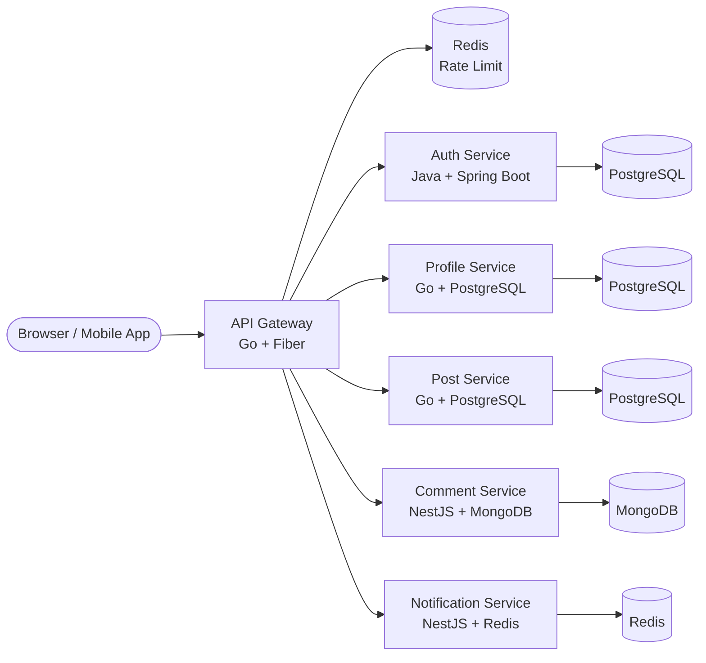

<p align="center">
  
</p>

<p align="center">
  
  
  
  
</p>

---

## 📝 Overview

**API Gateway** is the single entry point for all client requests to the A4AD Forum backend. It handles routing, JWT authentication, rate limiting, CORS, and provides a unified interface for frontend and mobile applications.

---

## ✨ Features

- 🚪 **Single Entry Point** — Unified API for all microservices
- 🔐 **JWT Validation** — Centralized token verification middleware
- ⚡ **Rate Limiting** — Redis-based request throttling per user/IP
- 🌐 **CORS Support** — Configurable cross-origin resource sharing
- 📊 **Prometheus Metrics** — Built-in observability and monitoring
- 🏥 **Health Checks** — Kubernetes-ready liveness and readiness probes
- 🔄 **Request Routing** — Intelligent proxying to backend services
- 📝 **Request Logging** — Structured logging with trace IDs

---

## 🛠 Tech Stack

- **Language:** Go 1.23+
- **Framework:** Fiber v2 (high-performance HTTP framework)
- **Authentication:** golang-jwt/jwt v5
- **Rate Limiting:** Redis with go-redis/v9
- **Configuration:** Viper for YAML/ENV config
- **Logging:** Zap (structured logging)
- **Metrics:** Prometheus client
- **Tracing:** OpenTelemetry

---

## 📊 Architecture



---

## 🚀 Quick Start

### Prerequisites

- Go 1.23 or higher
- Redis 7.x
- Docker & Docker Compose (optional)

### Installation

1. **Clone the repository:**
   ```bash
   git clone https://github.com/A4AD-team/api-gateway.git
   cd api-gateway
   ```

2. **Install dependencies:**
   ```bash
   go mod download
   ```

3. **Start Redis:**
   ```bash
   docker compose up -d redis
   ```

4. **Configure environment:**
   ```bash
   cp .env.example .env
   # Edit .env with your configuration
   ```

5. **Run the service:**
   ```bash
   # Development mode
   go run ./cmd/gateway

   # Or with custom config
   go run ./cmd/gateway -config=./config/local.yaml
   ```

The gateway will be available at `http://localhost:8080`

---

## 🔧 Environment Variables

| Variable | Description | Default | Required |
|----------|-------------|---------|----------|
| `APP_ENV` | Environment (development, staging, production) | `development` | No |
| `APP_PORT` | HTTP server port | `8080` | No |
| `APP_HOST` | HTTP server host | `0.0.0.0` | No |
| `REDIS_ADDR` | Redis connection string | `localhost:6379` | Yes |
| `REDIS_PASSWORD` | Redis password | `` | No |
| `REDIS_DB` | Redis database number | `0` | No |
| `RATE_LIMIT_REQUESTS` | Max requests per window | `100` | No |
| `RATE_LIMIT_WINDOW` | Rate limit window in seconds | `60` | No |
| `JWT_SECRET` | JWT signing secret | `` | Yes |
| `AUTH_SERVICE_URL` | Auth service URL | `http://localhost:8081` | Yes |
| `PROFILE_SERVICE_URL` | Profile service URL | `http://localhost:8082` | Yes |
| `POST_SERVICE_URL` | Post service URL | `http://localhost:8083` | Yes |
| `COMMENT_SERVICE_URL` | Comment service URL | `http://localhost:8084` | Yes |
| `NOTIFICATION_SERVICE_URL` | Notification service URL | `http://localhost:8085` | Yes |
| `CORS_ALLOWED_ORIGINS` | Allowed CORS origins | `http://localhost:3000` | No |
| `LOG_LEVEL` | Logging level (debug, info, warn, error) | `info` | No |

---

## 📡 API Endpoints

### Public Routes (No JWT Required)

| Method | Path | Description | Destination |
|--------|------|-------------|-------------|
| `POST` | `/auth/sign-up` | User registration | Auth Service |
| `POST` | `/auth/sign-in` | User login | Auth Service |
| `POST` | `/auth/refresh` | Refresh access token | Auth Service |
| `GET` | `/health` | Health check | Gateway |
| `GET` | `/metrics` | Prometheus metrics | Gateway |

### Protected Routes (JWT Required)

| Method | Path | Description | Destination |
|--------|------|-------------|-------------|
| `GET` | `/api/v1/users/me` | Current user info | Auth Service |
| `GET` | `/api/v1/profiles/:username` | Get user profile | Profile Service |
| `PATCH` | `/api/v1/profiles/me` | Update own profile | Profile Service |
| `GET` | `/api/v1/posts` | List posts | Post Service |
| `POST` | `/api/v1/posts` | Create post | Post Service |
| `GET` | `/api/v1/posts/:id` | Get post details | Post Service |
| `PATCH` | `/api/v1/posts/:id` | Update post | Post Service |
| `DELETE` | `/api/v1/posts/:id` | Delete post | Post Service |
| `POST` | `/api/v1/posts/:id/like` | Like/unlike post | Post Service |
| `GET` | `/api/v1/comments` | List comments | Comment Service |
| `POST` | `/api/v1/comments` | Create comment | Comment Service |
| `PATCH` | `/api/v1/comments/:id` | Update comment | Comment Service |
| `DELETE` | `/api/v1/comments/:id` | Delete comment | Comment Service |
| `POST` | `/api/v1/comments/:id/like` | Like/unlike comment | Comment Service |
| `GET` | `/api/v1/notifications` | List notifications | Notification Service |
| `PATCH` | `/api/v1/notifications/:id/read` | Mark as read | Notification Service |

---

## 🩺 Health Checks

The gateway exposes health endpoints for monitoring and orchestration:

| Endpoint | Method | Description |
|----------|--------|-------------|
| `/health` | `GET` | Overall health status (200 OK if healthy) |
| `/health/live` | `GET` | Liveness probe for Kubernetes |
| `/health/ready` | `GET` | Readiness probe — checks downstream services |

### Example Response

```json
{
  "status": "healthy",
  "timestamp": "2026-02-12T15:30:00Z",
  "version": "0.1.0",
  "services": {
    "auth": "healthy",
    "profile": "healthy",
    "post": "healthy",
    "comment": "healthy",
    "notification": "healthy"
  }
}
```

---

## 🧪 Testing

```bash
# Run all tests
go test ./...

# Run tests with coverage
go test -cover ./...

# Run specific test
go test -run TestRateLimiter ./...
```

---

## 📄 License

This project is licensed under the MIT License — see the [LICENSE](LICENSE) file for details.

---

<p align="center">
  <strong>Built with ❤️ by A4AD Team</strong>
</p>
