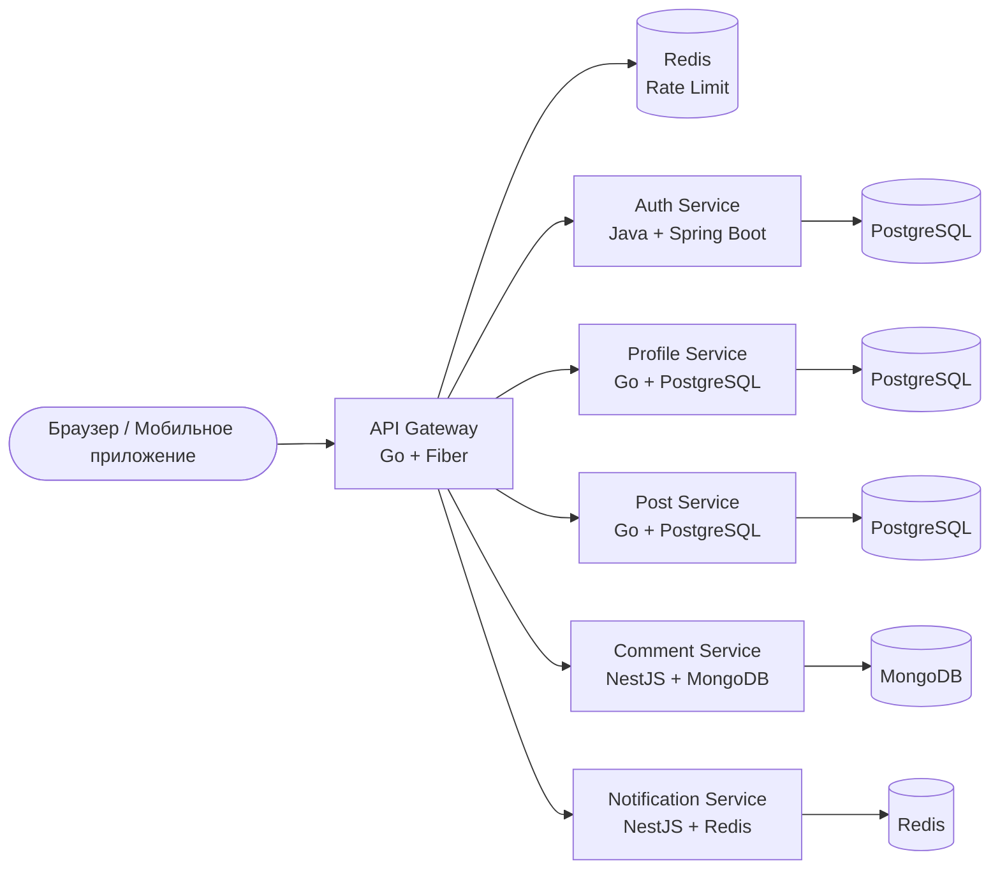

<p align="center">
  
</p>

<p align="center">
  
  
  
  
</p>

---

## 📝 Описание

**API Gateway** — единая точка входа для всех запросов клиентов к бэкенду форума A4AD. Обрабатывает маршрутизацию, JWT-аутентификацию, rate limiting, CORS и предоставляет унифицированный интерфейс для фронтенда и мобильных приложений.

---

## ✨ Возможности

- 🚪 **Единая точка входа** — Унифицированный API для всех микросервисов
- 🔐 **JWT-валидация** — Централизованная проверка токенов
- ⚡ **Rate Limiting** — Ограничение запросов через Redis на основе пользователя/IP
- 🌐 **CORS** — Настраиваемая поддержка кросс-доменных запросов
- 📊 **Prometheus-метрики** — Встроенная наблюдаемость и мониторинг
- 🏥 **Health Checks** — Пробы жизнеспособности для Kubernetes
- 🔄 **Маршрутизация** — Интеллектуальная проксирование запросов
- 📝 **Логирование** — Структурированное логирование с trace ID

---

## 🛠 Технологический стек

- **Язык:** Go 1.23+
- **Фреймворк:** Fiber v2 (высокопроизводительный HTTP-фреймворк)
- **Аутентификация:** golang-jwt/jwt v5
- **Rate Limiting:** Redis с go-redis/v9
- **Конфигурация:** Viper для YAML/ENV
- **Логирование:** Zap (структурированное)
- **Метрики:** Prometheus client
- **Трассировка:** OpenTelemetry

---

## 📊 Архитектура



---

## 🚀 Быстрый старт

### Требования

- Go 1.23 или выше
- Redis 7.x
- Docker & Docker Compose (опционально)

### Установка

1. **Клонирование репозитория:**
   ```bash
   git clone https://github.com/A4AD-team/api-gateway.git
   cd api-gateway
   ```

2. **Установка зависимостей:**
   ```bash
   go mod download
   ```

3. **Запуск Redis:**
   ```bash
   docker compose up -d redis
   ```

4. **Настройка окружения:**
   ```bash
   cp .env.example .env
   # Отредактируйте .env с вашими настройками
   ```

5. **Запуск сервиса:**
   ```bash
   # Режим разработки
   go run ./cmd/gateway

   # Или с пользовательской конфигурацией
   go run ./cmd/gateway -config=./config/local.yaml
   ```

Шлюз будет доступен по адресу `http://localhost:8080`

---

## 🔧 Переменные окружения

| Переменная | Описание | Значение по умолчанию | Обязательная |
|------------|----------|----------------------|--------------|
| `APP_ENV` | Окружение (development, staging, production) | `development` | Нет |
| `APP_PORT` | Порт HTTP-сервера | `8080` | Нет |
| `APP_HOST` | Хост HTTP-сервера | `0.0.0.0` | Нет |
| `REDIS_ADDR` | Строка подключения к Redis | `localhost:6379` | Да |
| `REDIS_PASSWORD` | Пароль Redis | `` | Нет |
| `REDIS_DB` | Номер базы данных Redis | `0` | Нет |
| `RATE_LIMIT_REQUESTS` | Макс. запросов за окно | `100` | Нет |
| `RATE_LIMIT_WINDOW` | Окно ограничения в секундах | `60` | Нет |
| `JWT_SECRET` | Секрет для подписи JWT | `` | Да |
| `AUTH_SERVICE_URL` | URL сервиса аутентификации | `http://localhost:8081` | Да |
| `PROFILE_SERVICE_URL` | URL сервиса профилей | `http://localhost:8082` | Да |
| `POST_SERVICE_URL` | URL сервиса постов | `http://localhost:8083` | Да |
| `COMMENT_SERVICE_URL` | URL сервиса комментариев | `http://localhost:8084` | Да |
| `NOTIFICATION_SERVICE_URL` | URL сервиса уведомлений | `http://localhost:8085` | Да |
| `CORS_ALLOWED_ORIGINS` | Разрешённые CORS-источники | `http://localhost:3000` | Нет |
| `LOG_LEVEL` | Уровень логирования | `info` | Нет |

---

## 📡 Эндпоинты

### Публичные маршруты (без JWT)

| Метод | Путь | Описание | Назначение |
|-------|------|----------|------------|
| `POST` | `/auth/sign-up` | Регистрация пользователя | Auth Service |
| `POST` | `/auth/sign-in` | Вход пользователя | Auth Service |
| `POST` | `/auth/refresh` | Обновление токена | Auth Service |
| `GET` | `/health` | Проверка здоровья | Gateway |
| `GET` | `/metrics` | Метрики Prometheus | Gateway |

### Защищённые маршруты (требуется JWT)

| Метод | Путь | Описание | Назначение |
|-------|------|----------|------------|
| `GET` | `/api/v1/users/me` | Информация о текущем пользователе | Auth Service |
| `GET` | `/api/v1/profiles/:username` | Получить профиль пользователя | Profile Service |
| `PATCH` | `/api/v1/profiles/me` | Обновить свой профиль | Profile Service |
| `GET` | `/api/v1/posts` | Список постов | Post Service |
| `POST` | `/api/v1/posts` | Создать пост | Post Service |
| `GET` | `/api/v1/posts/:id` | Детали поста | Post Service |
| `PATCH` | `/api/v1/posts/:id` | Обновить пост | Post Service |
| `DELETE` | `/api/v1/posts/:id` | Удалить пост | Post Service |
| `POST` | `/api/v1/posts/:id/like` | Лайк/дизлайк поста | Post Service |
| `GET` | `/api/v1/comments` | Список комментариев | Comment Service |
| `POST` | `/api/v1/comments` | Создать комментарий | Comment Service |
| `PATCH` | `/api/v1/comments/:id` | Обновить комментарий | Comment Service |
| `DELETE` | `/api/v1/comments/:id` | Удалить комментарий | Comment Service |
| `POST` | `/api/v1/comments/:id/like` | Лайк/дизлайк комментария | Comment Service |
| `GET` | `/api/v1/notifications` | Список уведомлений | Notification Service |
| `PATCH` | `/api/v1/notifications/:id/read` | Отметить прочитанным | Notification Service |

---

## 🩺 Health Checks

Шлюз предоставляет health-эндпоинты для мониторинга и оркестрации:

| Эндпоинт | Метод | Описание |
|----------|-------|----------|
| `/health` | `GET` | Общий статус здоровья (200 OK если всё хорошо) |
| `/health/live` | `GET` | Liveness-проба для Kubernetes |
| `/health/ready` | `GET` | Readiness-проба — проверка downstream-сервисов |

### Пример ответа

```json
{
  "status": "healthy",
  "timestamp": "2026-02-12T15:30:00Z",
  "version": "0.1.0",
  "services": {
    "auth": "healthy",
    "profile": "healthy",
    "post": "healthy",
    "comment": "healthy",
    "notification": "healthy"
  }
}
```

---

## 🧪 Тестирование

```bash
# Запуск всех тестов
go test ./...

# Запуск с покрытием
go test -cover ./...

# Запуск конкретного теста
go test -run TestRateLimiter ./...
```

---

## 📄 Лицензия

Проект распространяется под лицензией MIT — подробности в файле [LICENSE](LICENSE).

---

<p align="center">
  <strong>Создано с ❤️ командой A4AD</strong>
</p>
